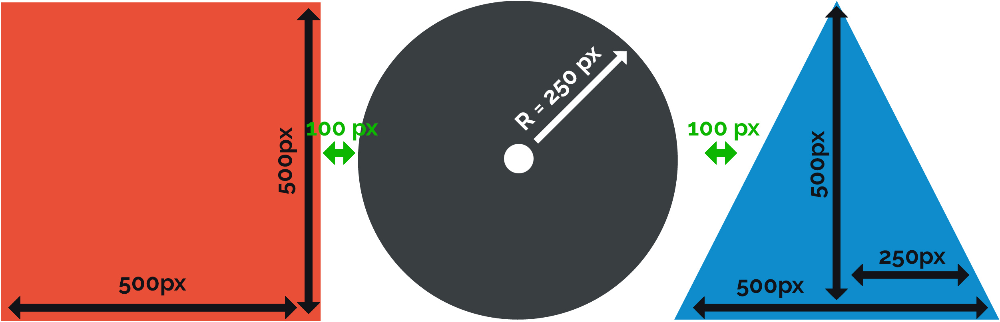
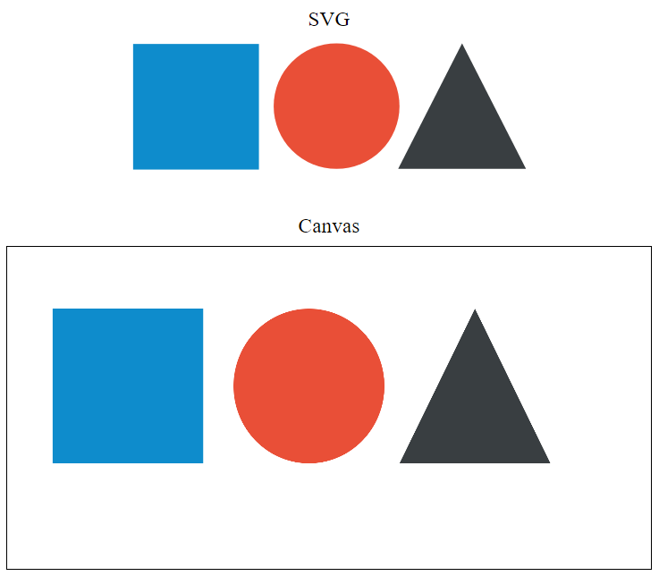
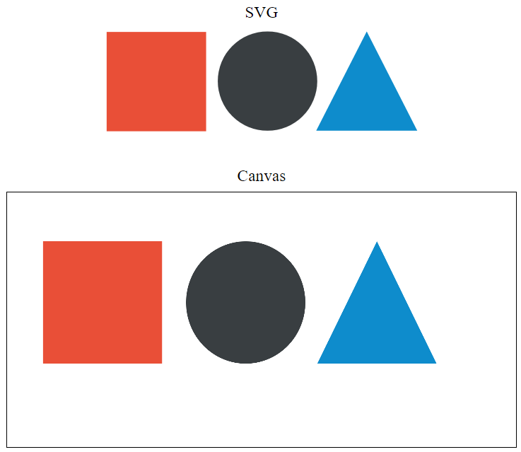

# RIA1HTML5

## Exercices manipulation de DOM - [ 15 min ]

1. Créer une page HTML5 en suivant l'image en indication et y inclure la librairie Bulma.
2. Ajouter un formulaire qui, à l'envoi, rajoute la valeur d'un input dans la page (pas de rafraichissement ni AJAX).

### Exercice avancé
1. Ajoutez une couleur aléatoire à chaque création de div (voir exercice 2).

## Exercices SVG & Canvas - [ 25 min ]

### Introduction

Le but de cet exercice est de recréer le schèma ci-dessous en "Canvas", ce schema se trouve déjà sur le template fourni pour l'éxercice, mais il ne contient pas les tailles des objets.



Une fois que la création du canvas sera terminé, il vous faudra apporter une modification au canvas, puis apporter la même modifcation au SVG.


### Pré-requis 

Copié/collé le code suivant, dans la section "SVG et canvas"

```html
<div class="Label">SVG</div>

<div class="Label">Canvas</div>
<canvas id="myCanvas"></canvas>
<script src="canvas.js"></script>
```


---

### Commandes utiles

- Choisir la couleur de remplissage d'une forme

```javascript
fillStyle = '#'
```

- Remplir un rectangle

```javascript
fillRect = 'x: int, y: int, width: int, height: int'
```

- Dessiner un cercle

```javascript
arc = 'x: int, y: int, r: int, startAngle: float, endAngle: float, drawCounterClockwise: bool'
// StartAngle : 0 
// endAngle : Math.PI * 2
// drawCounterClockwise : false
```

- Commencer un tracé

```javascript
beginPath();
```

- Définir un point de départ

```javascript
moveTo(x: int, y: int)
```

- Tirer un trait

```javascript
lineTo(x: int, y: int)
```

- Dessiner les traits

```javascript
stroke()
```

- Remplir une forme

```javascript
fill()
```

---

### Informations relatives au svg 

Dans un fichier .svg se trouve une partie "Style" qui fonctionne comme du CSS, l'attribut fill définis la couleur de remplissage. On peut également retrouvé le nom que la forme possède, son id et sa classe, il est également possible de modifier des points, positions ou tailles directement sur le SVG.

---

### Consignes

#### Exercice 1 : [ 20 min ]

Reproduire en canvas, le contenu du SVG directement disponible sur le template.

Le résultat final devra être le suivant : 



---

#### Exercice 2 : [ 5 min ]

- Rendre le carré rouge
- Rendre le rond noir
- Rendre le triangle bleu

Reproduire ceci également sur le SVG qui se trouve dans (/images/shapes.svg)

Le résultat final devra être le suivant : 



## Exercice WebWorkers - HTML5 (20 min)

### Objectifs

Créer un WebWorker et lui assigner une tâche.

### Informations

WebWorkers API ne fonctionne pas en local avec **Google Chrome**, il va falloir utiliser un autre navigateur. Testé et validé avec Firefox.

#### Dossier source : RIA1HTML5/exerciceWebWorkers

#### Partie 1

Pour la première partie, l'objectif va être de multiplier la valeur 1 par la valeur 2 et d'afficher le résultat dessous. Pour ce faire, le fichier main.js est déjà complet, il vous faudra modifier le fichier *worker.js* contenant la logique du Worker. Voici le résultat souhaité :


#### Partie 2

Si l'utilisateur tape du texte dans les champs, le calcul ne doit plus être une multiplication mais une addition. Voici le résultat souhaité : 


#### Aide : 

https://www.synbioz.com/blog/introduction_aux_web_workers

https://www.html5rocks.com/en/tutorials/workers/basics/

## Exercices localStorage [5 - 10 min]

Le but de cet exercice est de se familiariser avec l'utilisation du localStorage.

1. Récupérez le contenu de localStorage sous la clé **users**
2. Listez les utilisateurs dans la section correspondante
3. Ajoutez les utilisateurs **Marcel** et **Jean-Jacques** dans le storage

### Questions 

1. De quelle(s) manière(s) peut-on vérifier le contenu du localStorage ?
2. Dans quels cas on utilise le localStorage ou les cookies ? Donnez un exemple pour chacun
